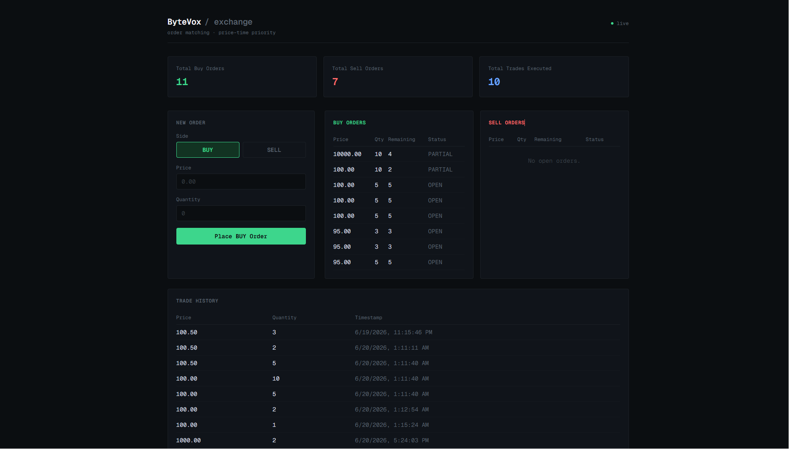
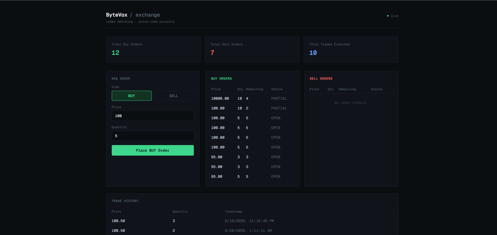

# BYTEVOX Trading Exchange

A simplified exchange simulation built for the ByteVox Full Stack Engineering Internship Technical Assignment.

The application allows users to place buy and sell orders, automatically matches compatible orders, maintains an order book, records completed trades, and provides real-time updates through WebSockets.

## Features

### Core Features

- Buy and Sell Order Submission
- Price-Time Priority Matching Engine
- Partial Order Fills
- Live Order Book
- Trade History
- Exchange Statistics Dashboard

### Bonus Features Implemented

- Real-Time Updates using WebSockets
- Docker Support
- Docker Compose Support
- Live Deployment

## Tech Stack

### Frontend

- Next.js
- TypeScript
- React

### Backend

- Express.js
- TypeScript
- Prisma ORM

### Database

- SQLite

### Real-Time Communication

- WebSockets

### Containerization

- Docker
- Docker Compose

## Matching Logic

The matching engine follows price-time priority.

BUY orders match against the lowest available SELL orders.

SELL orders match against the highest available BUY orders.

Trades execute whenever:

BUY_PRICE >= SELL_PRICE

Partial fills are supported.

## API Endpoints

POST /orders

GET /orderbook

GET /trades

GET /stats

## Running Locally

### Backend

cd backend

npm install

npm run dev

### Frontend

cd frontend

npm install

npm run dev

## Docker

docker compose up

## Deployment

Frontend:
https://bytevox-trading-exchange.vercel.app

Backend:
https://bytevox-trading-exchange.onrender.com

## Bonus Features

### Real-Time Updates

Implemented using WebSockets.

Whenever a new order is submitted and processed, the backend broadcasts an update event.

Connected clients automatically refresh:

- Order Book
- Trade History
- Statistics

### Docker Support

The application includes Docker and Docker Compose configuration for consistent setup across environments.

## Screenshots

### Dashboard

### Trade History

## Author

Divyanshu Gairwal